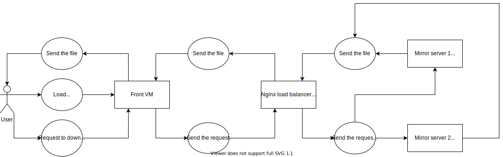

# SNA final project
## Project description
The task that we set up to solve is implementing and deploying a
simple Flask application for downloading a file over HTTP that
utilizes Nginx load balancer as well as Vagrant virtual machines for
simulating the work of multiple real servers
## Technology stack
1. Flask
2. HTML
3. Vagrant
4. Nginx
## Repository structure
1. ```/conf``` - the directory with all necessary configuration files: 
   1. ```Vagrantfile``` - file for running Vagrant VMs
   2. ```default.conf``` - file for the Nginx load balancer
   3. ```server.service``` - file that runs the daemon for the server
2. ```mirror_server``` - the directory for the mirror servers:
   1. ```files/file.txt``` - file to be downloaded
   2. ```app.py``` file with the backend itself
3. ```server``` - the directory for the frontend server
   1. ```template/index.html``` - web page with the link to download the file
   2. ```app.py``` - file with the frontend itself
   3. ```requirements.txt``` - the dependencies to be installed on front VM
## System diagram

## How to run the system
1. Download and unpack the archive with .box files and Vagrantfile from the following [link](https://drive.google.com/file/d/1kEm5UyYV1Mk-roqmd8fiVJp4yFp--nio/view?usp=sharing)
2. Run the Vagrant VMs using the ```vagrant up``` command
3. (Optional, only in case if SSH does not work for Vagrant VMs)  
   Copy ```/path/to/.vagrant.d/insecure_private_key``` on the host machine and write it to ```.ssh/authorized_keys```
   on VM using synced folder and VM GUI
4. Login into mirror server 1 using ```vagrant ssh mirror1``` and put in the file ```~/mirror_server/files/file.txt``` 
   the following content:  
   ```Hello from server 1!!!```  
   Repeat the same procedure for VM mirror2, but instead, put in the same file the following content:  
   ```Hello from server 2!!!```
5. Load ```localhost:5000``` in the browser and download the file using the link that will show up several times
6. Now you can make sure that every ```file.txt``` is downloaded from the different mirror server
### Troubleshooting
In case of troubles, make sure that all necessary .service files are running (```/etc/systemd/system/server.service```
for front VM and ```/etc/systemd/system/mirror.service``` for two backend VMs)
## Demo video link
From the [demo](https://drive.google.com/file/d/1ngB-8yesQug6AzEl7dv0-hKj37yzttjY/view?usp=sharing) you can see that every time ```file.txt``` is downloaded from the different server:
## Authors
Andrey Palaev - report composing  
Georgy Andryushchenko - report composing  
Dinislam Gabitov - deploying  
Roman Nabiullin - application programming